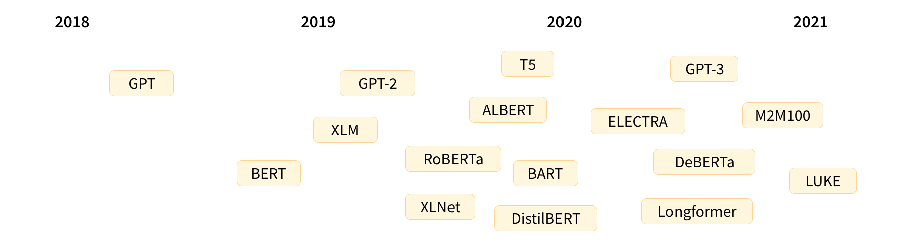

## Bienvenue à l'ère de l'IA générative

Depuis l'arrivée de l'intelligence artificielle dans les années 1950 voire 1951, elle n'a pas cessé de se developpper
et de continuer à faire des bonds de géants qui ont suscité l'emerveillement et la curiosité des chercheurs(eres). 

 Alors on se pose la question suivante: 

- Comment se fait il que l'IA n'est apparue publiquement, aux yeux des humains quelques années plus tard ?

### Avant l'arrivé de l'intelligence artificielle

Dans les années antiques, il était question du raisonnement formel jusqu'aux XVIIème siècle, où les premières machines
à calculer sont apparues pour évoluer vers l'ordinateur moderne dans les XIXème et XXème siècle.

Étant donné que tout se passait paisiblement avec les mathématiques, une branche que les humains de cette époque ont
découvert est la **Statistique**, qui en 1892 est devenue une carte que les ordinateurs modernes arrivaient à perforer de façon rapide
et conséquent. Mais comme cela n'a pas suffit, la géante entreprise de la tech **IBM** créé les premières ordinateurs capables de calculer qu'on 
a surnommé les **Super-Calculateurs** qui existent encore à nos jours et beaucoup plus rapide et fines qu'aupparavant

En **1936**, naissent l'inégalable **Alan Turing** et le concept du **Turing Machine** qui sera la base de l'architecture 
des ordinateurs modernes, ce qui les a conduit à faire sortir les neurones artificiels dans les années 1941 qui est approximativement semblables aux neurones humains.
Faut donc croire que les neurones artificiels existaient donc depuis très longtemps parceque c'est l'etre humain qui faisait naitre tout ca dans la nature.

La chronologie de l'IA est jalonnée de plusieurs "hivers":

- Premier hiver de l'IA (1974-1980): Des critiques formelles remettent en cause les promesses des débuts, jugées irréalistes face aux limites techniques (puissance de calcul, données).
- Deuxième hiver de l'IA (1987-1993): Les systèmes experts, très coûteux et limités à des domaines étroits, déçoivent les investisseurs.
- Troisième hiver de l'IA (1993-2000): Les méthodes statistiques et probabilistes remplacent progressivement les approches symboliques.
- Quatrième hiver de l'IA (2010-2015): Le Deep Learning peine à convaincre en dehors de niches spécialisées, faute de données massives et de puissance de calcul suffisante.
- Cinquième hiver de l'IA (2020-aujourd'hui): L'ère des Modèles de Langage Massifs (LLM) et de l'IA générative, marquant une rupture qualitative et une diffusion grand public sans précédent.

Tout ca pour nous fait voir à la figure l'IA révolutionaire en 2020, le moment où toutes les entreprises, les institutions, les chercheurs, vont à la chasse pour s'en procurer ses systèmes
intelligents afin de séparer l'homme de certaines actions manuelles et répétitives pour se concentrer sur des tâches plus créatives et innovantes.

À partir des années 2024 jusqu'aujourd'hui, on est rentré dans la phase où tout le monde veut s'accaparer de cette intelligence artificielle, que ce soit les particuliers, les entreprises, les institutions, les chercheurs, etc.
On veut comprendre comment ça fonctionne, comment l'adapter à nos besoins, comment le perfectionner, comment l'utiliser pour résoudre nos problèmes, etc.

Mais dans tout ca, on oublie souvent de se poser les bonnes questions.

### Comment les modèles de Transformers fonctionnent-ils ?

:::{.callout-tip}
## Le fonctionnement des Transformers

 Narrons-nous un peu l'histoire des transformers.
 
 

:::